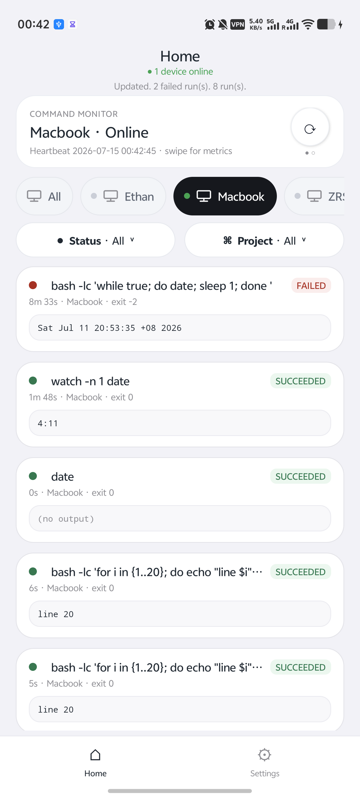
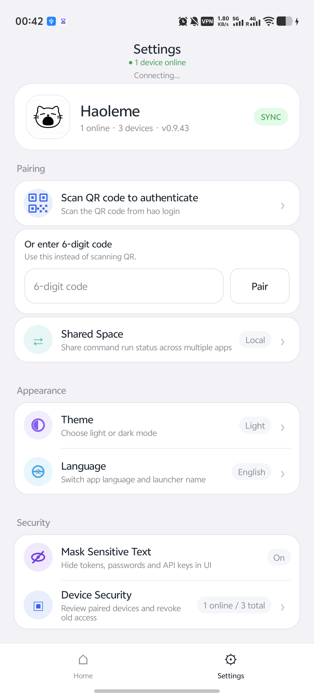

<p align="center">
  <strong>
    <a href="README.md">English</a>
    &nbsp;|&nbsp;
    <a href="README_CN.md">简体中文</a>
  </strong>
</p>

<p align="center">
  
</p>

<h1 align="center">Haoleme</h1>

<p align="center">
  Monitor commands on your computer or server from your phone.
</p>

<p align="center">
  <a href="https://haolemeapp.github.io/">Website</a>
  ·
  <a href="https://github.com/HaolemeApp/Haoleme/releases/download/v0.9.43/Haoleme-0.9.43.apk">Download APK</a>
  ·
  <a href="#quick-start">Quick Start</a>
  ·
  <a href="https://pypi.org/project/haoleme/">PyPI</a>
</p>

<p align="center">
  <a href="https://github.com/HaolemeApp/Haoleme/releases/download/v0.9.43/Haoleme-0.9.43.apk"></a>
  <a href="https://pypi.org/project/haoleme/"></a>
  <a href="https://github.com/HaolemeApp/Haoleme/issues"></a>
  <a href="LICENSE"></a>
</p>

## Official Links

- Website: <https://haolemeapp.github.io/>
- GitHub: <https://github.com/HaolemeApp/Haoleme>

## What Is It

Haoleme is a command monitoring tool.

Start a command with `hao`, then watch its status, console output, device online state, and finish notification in the mobile app. It is useful for training jobs, remote scripts, batch tasks, crawlers, long SSH sessions, and anything you do not want to babysit in a terminal.

## Preview

The home screen shows active and completed runs in one place. Settings covers pairing, shared spaces, appearance, and security options.

<table>
  <tr>
    <td align="center" valign="top"></td>
    <td align="center" valign="top"></td>
  </tr>
</table>

## Quick Start

### 1. Download the App

[Download Android APK 0.9.43](https://github.com/HaolemeApp/Haoleme/releases/download/v0.9.43/Haoleme-0.9.43.apk)

### 2. Install the CLI

```bash
pip install -U haoleme
```

### 3. Pair a Device

```bash
hao login
```

Open the app, then scan the QR code or enter the 6-digit pairing code.

### 4. Run a Command

Prefix your original command with `hao`:

```bash
hao python train.py
hao bash script.sh
hao echo hello
```

The app will show status and console output automatically.

## Features

- running / succeeded / failed status
- console output and search
- finish notifications
- multiple devices and online status
- device rename
- project grouping
- GPU / CPU monitoring
- QR code and 6-digit pairing
- end-to-end encryption for sensitive run content

## Source

- CLI and cloud protocol: `src/haoleme`
- Android app: `android-core`

## Security

The public source tree does not include official signing keys, private production deployment config, personal donation QR codes, or access tokens.

The app and CLI connect to the official service by default. You can also self-host from source. Do not commit your own keys, tokens, databases, signing files, or server passwords to a public repository.

## License

Haoleme is licensed under [AGPL-3.0-or-later](LICENSE).
