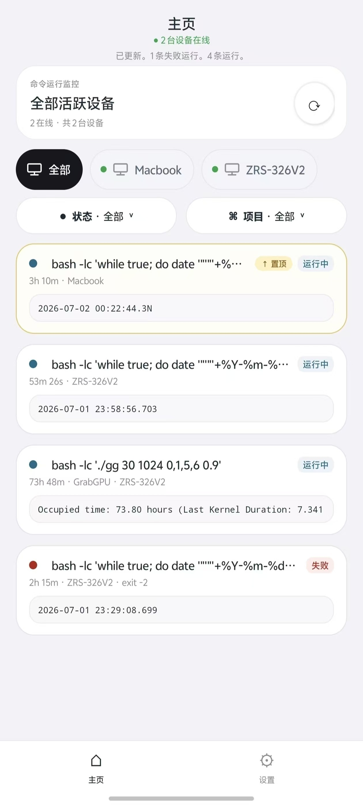

<p align="center">
  <strong>
    <a href="README.md">简体中文</a>
    &nbsp;|&nbsp;
    <a href="README_EN.md">English</a>
  </strong>
</p>

<p align="center">
  
</p>

<h1 align="center">好了么</h1>

<p align="center">
  在手机上查看电脑和服务器里的命令运行状态。
</p>

<p align="center">
  <a href="https://haolemeapp.github.io/">官网</a>
  ·
  <a href="https://github.com/HaolemeApp/Haoleme/releases/download/v0.9.43/Haoleme-0.9.43.apk">下载 APK</a>
  ·
  <a href="https://pypi.org/project/haoleme/">PyPI</a>
</p>

<p align="center">
  <a href="https://github.com/HaolemeApp/Haoleme/releases/download/v0.9.43/Haoleme-0.9.43.apk"></a>
  <a href="https://pypi.org/project/haoleme/"></a>
  <a href="https://github.com/HaolemeApp/Haoleme/issues"></a>
  <a href="LICENSE"></a>
  <a href="https://github.com/HaolemeApp/Haoleme/stargazers"></a>
</p>

## 官方地址

- 官网：<https://haolemeapp.github.io/>
- GitHub：<https://github.com/HaolemeApp/Haoleme>

## 这是什么

好了么是一个命令运行监控工具。

在电脑或服务器上用 `hao` 启动命令，手机 App 就能看到运行状态、终端输出、设备在线状态和运行结束通知。它适合训练任务、远程脚本、批处理、爬虫、长时间 SSH 任务，以及任何“不想一直盯着终端”的场景。

## 界面预览

首页集中展示正在运行和已经结束的命令；设置页提供配对、共享空间、外观和安全选项。

<table>
  <tr>
    <td align="center" valign="top"></td>
    <td align="center" valign="top"></td>
  </tr>
</table>

## 快速开始

### 1. 下载 App

[直接下载 Android APK 0.9.43](https://github.com/HaolemeApp/Haoleme/releases/download/v0.9.43/Haoleme-0.9.43.apk)

### 2. 安装 CLI

```bash
pip install -U haoleme
```

### 3. 配对设备

```bash
hao login
```

打开 App，扫码或输入 6 位配对码。

### 4. 运行命令

直接在原命令前加 `hao`：

```bash
hao python train.py
hao bash script.sh
hao echo hello
```

命令运行后，App 会自动显示状态和控制台输出。

## 功能

- 运行状态：running / succeeded / failed
- 控制台输出和搜索
- 运行结束通知
- 多设备切换和在线状态
- 设备重命名
- 项目分组
- GPU / CPU 监控
- 二维码和 6 位配对码
- 端到端加密传输敏感运行内容

## 源码

- CLI 和云端协议：`src/haoleme`
- Android App：`android-core`

## 安全

公开源码不包含官方签名密钥、生产服务器私密配置、个人收款码或访问令牌。

App 和 CLI 采用端对端加密，保证用户数据安全。

## 开源协议

本项目使用 [AGPL-3.0-or-later](LICENSE) 许可证。

欢迎提交 Issue 和建议。项目仍在快速迭代，公测阶段建议保持 App 和 CLI 为最新版。
