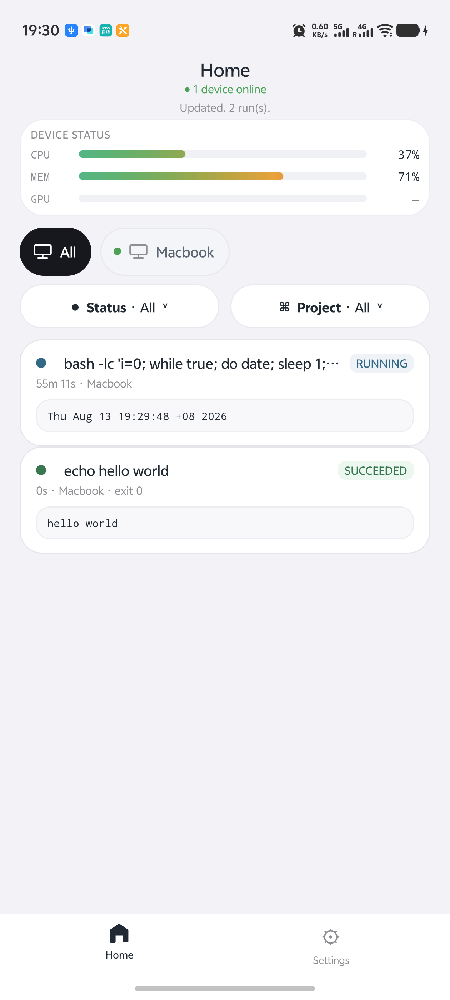
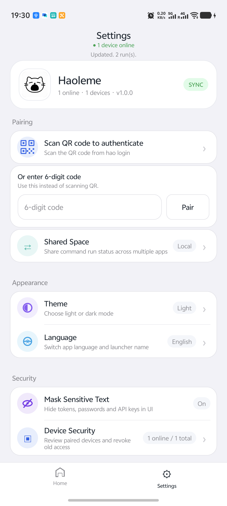
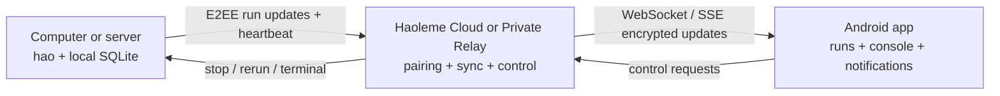

<p align="center">
  <a href="README.md"></a>
  <a href="README_CN.md"></a>
</p>

<p align="center">
  
</p>

<h1 align="center">Haoleme</h1>

<p align="center">
  Run commands on your computer or server. Follow them from your phone.
</p>

<p align="center">
  <a href="https://haoleme.cloud/">Website</a>
  ·
  <a href="https://github.com/HaolemeApp/Haoleme/releases/download/v1.0.4/Haoleme-1.0.4.apk">Download APK</a>
  ·
  <a href="#quick-start">Quick Start</a>
  ·
  <a href="https://pypi.org/project/haoleme/">PyPI</a>
</p>

<p align="center">
  <a href="https://github.com/HaolemeApp/Haoleme/releases/download/v1.0.4/Haoleme-1.0.4.apk"></a>
  <a href="https://pypi.org/project/haoleme/"></a>
  <a href="https://github.com/HaolemeApp/Haoleme/issues"></a>
  <a href="LICENSE"></a>
</p>

<p align="center">
  <a href="https://trendshift.io/repositories/85658?utm_source=trendshift-badge&amp;utm_medium=badge&amp;utm_campaign=badge-trendshift-85658"></a>
</p>

> [!NOTE]
> **Haoleme v1.0.4 is a stable release.** Bottom navigation is aligned and live command summaries are more reliable, while realtime sync still falls back from WebSocket to SSE and HTTP. Model-training progress monitoring remains a feature in development.
> [View the release](https://github.com/HaolemeApp/Haoleme/releases/latest) or install it directly over an existing version.

## Why Haoleme

Haoleme is a local-first command monitor for work that should keep running while you do something else. Prefix a command with `hao`, then use the Android app to follow live output, switch between machines, receive completion notifications, or stop a task remotely. For supported model-training output, run cards can also surface the latest epoch, loss, elapsed time, and a visual progress bar.

It is built for model training, evaluations, remote scripts, batch jobs, crawlers, builds, and long SSH sessions. Commands and console output are end-to-end encrypted before they reach Haoleme Cloud or a self-hosted Relay.

## Preview

<table>
  <tr>
    <td align="center" valign="top"></td>
    <td align="center" valign="top"></td>
  </tr>
</table>

## Quick Start

### 1. Download the Android app

[Download Haoleme v1.0.4](https://github.com/HaolemeApp/Haoleme/releases/download/v1.0.4/Haoleme-1.0.4.apk)

### 2. Install the CLI

```bash
pip install -U haoleme
```

### 3. Pair this computer

```bash
hao login
```

Choose **Haoleme Cloud** or a self-hosted **Private Relay**, then scan the QR code or enter the 6-digit code in the app.

### 4. Run a command

Add `hao` before the command you already use:

```bash
hao echo hello
hao python train.py
hao bash script.sh
```

The run, live console output, and final status will appear in the app automatically.

## Requirements

- Android 6.0 or newer
- Python 3.7 or newer on Windows, macOS, or Linux
- Network access to Haoleme Cloud, or a reachable Private Relay

## Features

- **Live runs:** running, succeeded, and failed states with searchable console output and local history.
- **Training progress (in development):** detect common epoch, loss, and tqdm output and show progress directly on run cards. Recognition and presentation may change as this feature evolves.
- **Phone notifications:** know when a command completes or fails without watching SSH.
- **Multiple machines:** switch between computers and servers, rename devices, and see online status.
- **Projects and metrics:** group related runs and inspect CPU, memory, and GPU utilization.
- **Remote controls:** stop, rerun, open a remote terminal, or request shutdown after completion.
- **Per-device startup monitoring:** enable or disable background startup from the app, or use `hao autostart enable|disable|status`.
- **Efficient realtime delivery:** WebSocket updates keep runs and console previews in sync, with automatic SSE and HTTP fallback.
- **Private by design:** QR or 6-digit pairing, offline retry, local caches, and E2EE for sensitive run content.

## Agent Integrations

Haoleme includes a skill for Codex and Claude Code. It automatically monitors important training, full evaluation, deployment, and long-running tasks while leaving dependency installs, quick pretests, formatting, and routine Git commands local.

```bash
npx skills add HaolemeApp/Haoleme --skill monitor-with-haoleme -g -a codex -a claude-code -y
```

## Source

- CLI and Relay protocol: [`src/haoleme`](src/haoleme)
- Android app: [`android`](android/README.md)
- Deployment examples: [`deploy`](deploy/README.md)

## Architecture


```mermaid
flowchart LR
  HOST["Computer or server<br/>hao + local SQLite"]
  RELAY["Haoleme Cloud or Private Relay<br/>pairing + sync + control"]
  APP["Android app<br/>runs + console + notifications"]
  HOST -->|"E2EE run updates + heartbeat"| RELAY
  RELAY -->|"WebSocket / SSE encrypted updates"| APP
  APP -->|"control requests"| RELAY
  RELAY -->|"stop / rerun / terminal"| HOST
```

`hao` starts commands through a PTY and saves their state locally first. Network interruptions enter a retry queue. Commands, working directories, host details, and console output are encrypted with AES-256-GCM before upload; the Android app decrypts and caches them locally.

## Self-hosting

The standard app can connect to a Private Relay without a custom APK. For an Internet-facing HTTPS Relay:

```bash
hao login https://hao.example.com
```

For a trusted LAN, run `hao login`, choose **Private Relay**, then choose **Start a LAN Relay on this computer**. A domain is optional on a private network; HTTPS is required when exposing a Relay to the Internet.

See the [Private Relay deployment guide](deploy/RELAY.md) for Docker, Caddy, LAN mode, backups, and security guidance.

## Help and Contributing

- Read the [website](https://haoleme.cloud/) and repository documentation.
- Report bugs or request features in [GitHub Issues](https://github.com/HaolemeApp/Haoleme/issues).
- Read the [contribution guide](CONTRIBUTING.md) before opening a pull request.
- Report vulnerabilities privately according to the [security policy](SECURITY.md).

## Security

The public repository excludes official signing keys, production credentials, private deployment configuration, databases, logs, payment QR codes, and user run data. Official signing material and server credentials are injected through private environment configuration.

Run contents are end-to-end encrypted. Relay operators can still see the limited metadata required for pairing, synchronization, device presence, and delivery. See [SECURITY.md](SECURITY.md) for supported versions and private vulnerability reporting.

## License

Haoleme is licensed under [AGPL-3.0-or-later](LICENSE).
