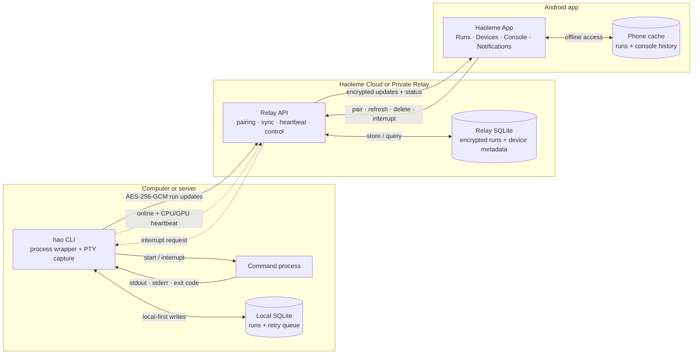

<p align="center">
  <a href="README.md"></a>
  <a href="README_CN.md"></a>
</p>

<p align="center">
  
</p>

<h1 align="center">Haoleme</h1>

<p align="center">
  Monitor commands on your computer or server from your phone.
</p>

<p align="center">
  <a href="https://haolemeapp.github.io/">Website</a>
  ·
  <a href="https://github.com/HaolemeApp/Haoleme/releases/download/v0.9.45/Haoleme-0.9.45.apk">Download APK</a>
  ·
  <a href="#quick-start">Quick Start</a>
  ·
  <a href="https://pypi.org/project/haoleme/">PyPI</a>
</p>

<p align="center">
  <a href="https://github.com/HaolemeApp/Haoleme/releases/download/v0.9.45/Haoleme-0.9.45.apk"></a>
  <a href="https://pypi.org/project/haoleme/"></a>
  <a href="https://github.com/HaolemeApp/Haoleme/issues"></a>
  <a href="LICENSE"></a>
</p>

<p align="center">
  <a href="https://trendshift.io/repositories/85658?utm_source=trendshift-badge&amp;utm_medium=badge&amp;utm_campaign=badge-trendshift-85658" target="_blank" rel="noopener noreferrer"></a>
</p>

> [!TIP]
> **Codex / Claude Code Skills are now supported**
>
> Codex and Claude Code can automatically identify important training, full evaluations, and long-running tasks, then use `hao` to sync status and output to the Haoleme app. Dependency installs, quick pretests, and other routine commands stay local. [See installation](#agent-skill)

## Official Links

- Website: <https://haolemeapp.github.io/>
- GitHub: <https://github.com/HaolemeApp/Haoleme>

## What Is It

Haoleme is a command monitoring tool.

Start a command with `hao`, then watch its status, console output, device online state, and finish notification in the mobile app. It is useful for training jobs, remote scripts, batch tasks, crawlers, long SSH sessions, and anything you do not want to babysit in a terminal.

## Preview

The home screen shows active and completed runs in one place. Settings covers pairing, shared spaces, appearance, and security options.

<table>
  <tr>
    <td align="center" valign="top"></td>
    <td align="center" valign="top"></td>
  </tr>
</table>

## Quick Start

### 1. Download the App

[Download Android APK 0.9.45](https://github.com/HaolemeApp/Haoleme/releases/download/v0.9.45/Haoleme-0.9.45.apk)

### 2. Install the CLI

```bash
pip install -U haoleme
```

### 3. Pair a Device

```bash
hao login
```

Choose Haoleme Cloud or a self-hosted Private Relay, then open the app and scan
the QR code or enter the 6-digit pairing code.

### 4. Run a Command

Prefix your original command with `hao`:

```bash
hao python train.py
hao bash script.sh
hao echo hello
```

The app will show status and console output automatically.

<a id="agent-skill"></a>

### 5. Let Codex / Claude Code Monitor Important Tasks

Install the skill globally for both Codex and Claude Code:

```bash
npx skills add HaolemeApp/Haoleme --skill monitor-with-haoleme -g -a codex -a claude-code -y
```

The skill adds `hao` to training, full evaluations, long batch jobs, and other important work. It leaves dependency installs, quick pretests, formatting, and routine Git commands local.

## Features

- running / succeeded / failed status
- console output and search
- finish notifications
- multiple devices and online status
- device rename
- project grouping
- GPU / CPU monitoring
- QR code and 6-digit pairing
- end-to-end encryption for sensitive run content

## Source

- CLI and cloud protocol: `src/haoleme`
- Android app: [`android`](android/README.md)
- Cloud deployment examples: [`deploy`](deploy/README.md)

## Architecture


```mermaid
flowchart LR
  subgraph Host["Computer or server"]
    CLI["hao CLI<br/>process wrapper + PTY capture"]
    PROC["Command process"]
    LOCAL[("Local SQLite<br/>runs + retry queue")]
    CLI -->|"start / interrupt"| PROC
    PROC -->|"stdout · stderr · exit code"| CLI
    CLI <-->|"local-first writes"| LOCAL
  end

  subgraph Relay["Haoleme Cloud or Private Relay"]
    API["Relay API<br/>pairing · sync · heartbeat · control"]
    CLOUD[("Relay SQLite<br/>encrypted runs + device metadata")]
    API <-->|"store / query"| CLOUD
  end

  subgraph Mobile["Android app"]
    APP["Haoleme App<br/>Runs · Devices · Console · Notifications"]
    CACHE[("Phone cache<br/>runs + console history")]
    APP <-->|"offline access"| CACHE
  end

  CLI -->|"AES-256-GCM run updates"| API
  CLI -.->|"online + CPU/GPU heartbeat"| API
  API -->|"encrypted updates + status"| APP
  APP -->|"pair · refresh · delete · interrupt"| API
  API -.->|"interrupt request"| CLI
```

- **Local first:** `hao` starts the command through a PTY, saves status and output to local SQLite, and retries cloud synchronization after a network interruption.
- **End-to-end encrypted:** during pairing, the app wraps the account encryption key with the CLI's temporary RSA-OAEP-SHA256 public key. The CLI encrypts commands, working directories, host details, and console output with AES-256-GCM before upload.
- **Replaceable relay:** Haoleme Cloud and a self-hosted Private Relay expose the same API. The relay stores encrypted run payloads plus the status and device metadata needed for synchronization; it does not receive plaintext command or console content.
- **Mobile cache and control:** the Android app decrypts runs locally, keeps run and console history on the phone, displays completion notifications, and sends interrupt or deletion requests back through the relay.

## Security

The public source tree does not include official signing keys, private production deployment config, real IP addresses, passwords, personal donation QR codes, or access tokens.

Official Android signing material and server credentials are injected through environment variables or private local configuration. See [SECURITY.md](SECURITY.md) for reporting guidance.

The app and CLI connect to the official service by default. You can also self-host from source. Do not commit your own keys, tokens, databases, signing files, or server passwords to a public repository.

## Private Relay

The normal Haoleme app also works with a self-hosted relay; no custom APK is
required. Deploy the Docker/Caddy stack in [`deploy/RELAY.md`](deploy/RELAY.md),
then pair a computer with one command:

```bash
hao login https://hao.example.com
```

Scanning that QR switches the app to the named relay. App credentials and E2EE
keys are isolated per relay, and private-relay QR codes never fall back to the
public Haoleme service.

For a trusted local network, a domain is optional:

```bash
hao login
```

Choose **Private Relay**, then **Start a LAN Relay on this computer**. `hao`
starts it in the background and immediately shows the pair code and QR. Other
computers can use the LAN address it prints. For explicit Relay-only control,
`haoleme-relay --lan --port 8000` remains available; add `--no-pair` to keep it
in the foreground without pairing the Relay host.

Local HTTP is restricted to private IP addresses. Keep it inside the LAN; use
HTTPS for any Internet-facing relay. See [`deploy/RELAY.md`](deploy/RELAY.md).

## License

Haoleme is licensed under [AGPL-3.0-or-later](LICENSE).
