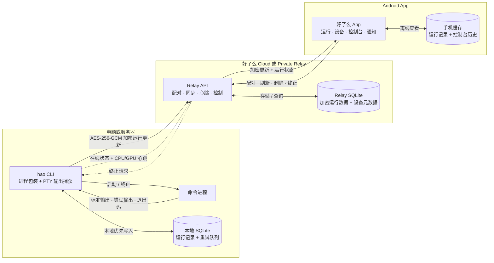

<p align="center">
  <a href="README.md"></a>
  <a href="README_CN.md"></a>
</p>

<p align="center">
  
</p>

<h1 align="center">好了么</h1>

<p align="center">
  在手机上查看电脑和服务器里的命令运行状态。
</p>

<p align="center">
  <a href="https://haolemeapp.github.io/">官网</a>
  ·
  <a href="https://github.com/HaolemeApp/Haoleme/releases/download/v1.0.0/Haoleme-1.0.0.apk">下载 APK</a>
  ·
  <a href="#快速开始">快速开始</a>
  ·
  <a href="https://pypi.org/project/haoleme/">PyPI</a>
</p>

<p align="center">
  <a href="https://github.com/HaolemeApp/Haoleme/releases/download/v1.0.0/Haoleme-1.0.0.apk"></a>
  <a href="https://pypi.org/project/haoleme/"></a>
  <a href="https://github.com/HaolemeApp/Haoleme/issues"></a>
  <a href="LICENSE"></a>
</p>

<p align="center">
  <a href="https://trendshift.io/repositories/85658?utm_source=trendshift-badge&amp;utm_medium=badge&amp;utm_campaign=badge-trendshift-85658" target="_blank" rel="noopener noreferrer"></a>
</p>

> [!TIP]
> **现已支持 Codex / Claude Code Skills**
>
> Codex 和 Claude Code 可以自动识别重要的训练、完整评测与长时间任务，使用 `hao` 将运行状态和输出同步到好了么 App；安装依赖、快速预测试等普通命令不会同步。 [查看安装方式](#agent-skill)

## 官方地址

- 官网：<https://haolemeapp.github.io/>
- GitHub：<https://github.com/HaolemeApp/Haoleme>

## 这是什么

好了么是一个命令运行监控工具。

在电脑或服务器上用 `hao` 启动命令，手机 App 就能看到运行状态、终端输出、设备在线状态和运行结束通知。它适合训练任务、远程脚本、批处理、爬虫、长时间 SSH 任务，以及任何“不想一直盯着终端”的场景。

## 界面预览

首页集中展示正在运行和已经结束的命令；设置页提供配对、共享空间、外观和安全选项。

<table>
  <tr>
    <td align="center" valign="top"></td>
    <td align="center" valign="top"></td>
  </tr>
</table>

## 快速开始

### 1. 下载 App

[直接下载 Android APK 1.0.0](https://github.com/HaolemeApp/Haoleme/releases/download/v1.0.0/Haoleme-1.0.0.apk)

### 2. 安装 CLI

```bash
pip install -U haoleme
```

### 3. 配对设备

```bash
hao login
```

选择好了么官方云或自建私有 Relay，然后打开 App 扫码或输入 6 位配对码。

### 4. 运行命令

直接在原命令前加 `hao`：

```bash
hao python train.py
hao bash script.sh
hao echo hello
```

命令运行后，App 会自动显示状态和控制台输出。

<a id="agent-skill"></a>

### 5. 让 Codex / Claude Code 自动监控重要任务

一条命令同时安装到 Codex 和 Claude Code：

```bash
npx skills add HaolemeApp/Haoleme --skill monitor-with-haoleme -g -a codex -a claude-code -y
```

Skill 会自动为训练、完整评测、长批处理等重要任务添加 `hao`；安装依赖、快速预测试、格式化和普通 Git 命令不会同步。

## 功能

- 运行状态：running / succeeded / failed
- 控制台输出和搜索
- 运行结束通知
- 多设备切换和在线状态
- 设备重命名
- 项目分组
- GPU / CPU 监控
- 二维码和 6 位配对码
- 端到端加密传输敏感运行内容

## 源码

- CLI 和云端协议：`src/haoleme`
- Android App：[`android`](android/README.md)
- 云端部署示例：[`deploy`](deploy/README.md)

## 整体架构



- **本地优先：**`hao` 通过 PTY 启动命令，先把状态和输出保存到本地 SQLite；网络中断后会自动重试云端同步。
- **端到端加密：**配对时，App 使用 CLI 的临时 RSA-OAEP-SHA256 公钥封装账户加密密钥。CLI 在上传前使用 AES-256-GCM 加密命令、工作目录、主机信息和控制台输出。
- **Relay 可替换：**好了么 Cloud 和自建 Private Relay 使用相同 API。Relay 保存加密后的运行数据，以及同步所需的状态和设备元数据，不会收到明文命令或控制台内容。
- **手机缓存与控制：**Android App 在本地解密运行数据，将运行记录和控制台历史缓存在手机上，显示结束通知，并通过 Relay 发送终止或删除请求。

## 安全

公开源码不包含官方签名密钥、生产服务器私密配置、真实 IP、密码、个人收款码或访问令牌。

Android 官方签名和服务器凭据只通过环境变量或本机私密配置注入，不会写入源码。安全问题请参阅 [SECURITY.md](SECURITY.md)。

App 和 CLI 采用端对端加密，保证用户数据安全。

## 私有 Relay

同一个好了么 App 可以直接连接自建 Relay，不需要重新编译专用 APK。按照
[`deploy/RELAY.md`](deploy/RELAY.md) 部署 Docker/Caddy 后，在需要监控的电脑上只需：

```bash
hao login https://hao.example.com
```

用 App 扫描终端二维码即可自动切换。每个 Relay 分别保存 App Token 和端到端
加密密钥，私有 Relay 的二维码不会回退到官方云进行配对。

可信局域网内也可以不准备域名和证书：

```bash
hao login
```

依次选择 **Private Relay** 和 **Start a LAN Relay on this computer**，`hao`
会自动在后台启动 Relay，并直接显示配对码和二维码。其他电脑可使用它显示的局域网
地址。需要手动管理 Relay 时，仍可使用 `haoleme-relay --lan --port 8000`；增加
`--no-pair` 可只在前台启动 Relay。

局域网 HTTP 只允许私有 IP，请勿将该端口映射到公网。公网或不可信网络仍应使用
HTTPS。完整说明见 [`deploy/RELAY.md`](deploy/RELAY.md)。

## 开源协议

本项目使用 [AGPL-3.0-or-later](LICENSE) 许可证。

欢迎提交 Issue 和建议。项目仍在快速迭代，公测阶段建议保持 App 和 CLI 为最新版。
