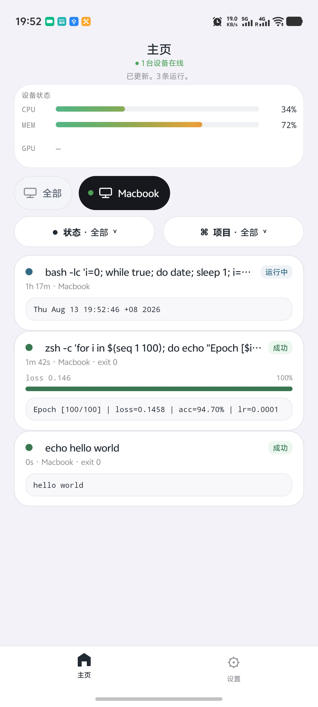
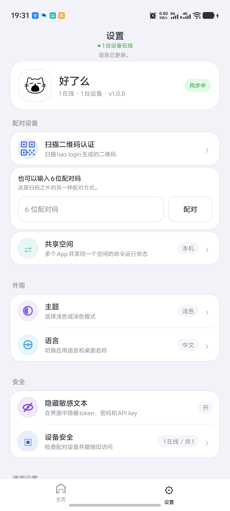
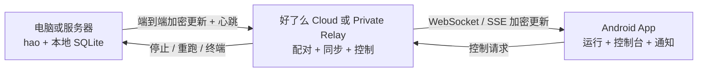

<p align="center">
  <a href="README.md"></a>
  <a href="README_CN.md"></a>
</p>

<p align="center">
  
</p>

<h1 align="center">好了么</h1>

<p align="center">
  让命令在电脑或服务器上运行，用手机随时查看。
</p>

<p align="center">
  <a href="https://haoleme.cloud/">官网</a>
  ·
  <a href="https://github.com/HaolemeApp/Haoleme/releases/download/v1.0.2/Haoleme-1.0.2.apk">下载 APK</a>
  ·
  <a href="#快速开始">快速开始</a>
  ·
  <a href="https://pypi.org/project/haoleme/">PyPI</a>
</p>

<p align="center">
  <a href="https://github.com/HaolemeApp/Haoleme/releases/download/v1.0.2/Haoleme-1.0.2.apk"></a>
  <a href="https://pypi.org/project/haoleme/"></a>
  <a href="https://github.com/HaolemeApp/Haoleme/issues"></a>
  <a href="LICENSE"></a>
</p>

<p align="center">
  <a href="https://trendshift.io/repositories/85658?utm_source=trendshift-badge&amp;utm_medium=badge&amp;utm_campaign=badge-trendshift-85658"></a>
</p>

> [!NOTE]
> **好了么 v1.0.2 是稳定版本。** 新增 WebSocket 实时同步，并保留 SSE 与 HTTP 降级通道；模型训练进度监控仍属于开发中功能。
> [查看最新 Release](https://github.com/HaolemeApp/Haoleme/releases/latest)，已有版本可以直接覆盖安装升级。

## 为什么使用好了么

好了么是一个本地优先的命令监控工具，适合那些“应该继续运行，但不值得一直守在终端前”的任务。在原命令前加上 `hao`，就可以在 Android App 中查看实时输出、切换设备、接收结束通知，或远程停止任务。对于能够识别的模型训练输出，运行卡片还会显示最新 Epoch、loss、耗时和可视化进度条。

它适合模型训练、完整评测、远程脚本、批处理、爬虫、构建和长时间 SSH 会话。命令与控制台输出会先进行端到端加密，再发送到好了么 Cloud 或自建 Relay。

## 界面预览

<table>
  <tr>
    <td align="center" valign="top"></td>
    <td align="center" valign="top"></td>
  </tr>
</table>

## 快速开始

### 1. 下载 Android App

[下载好了么 v1.0.2](https://github.com/HaolemeApp/Haoleme/releases/download/v1.0.2/Haoleme-1.0.2.apk)

### 2. 安装 CLI

```bash
pip install -U haoleme
```

### 3. 配对这台电脑

```bash
hao login
```

选择 **Haoleme Cloud** 或自建 **Private Relay**，然后在 App 中扫描二维码或输入 6 位配对码。

### 4. 运行命令

在原来使用的命令前加上 `hao`：

```bash
hao echo hello
hao python train.py
hao bash script.sh
```

运行状态、实时控制台输出和最终结果会自动显示在 App 中。

## 使用要求

- Android 6.0 或更高版本
- Windows、macOS 或 Linux 上的 Python 3.7 或更高版本
- 可以访问好了么 Cloud，或能够连接到自建 Private Relay

## 功能

- **实时运行：**查看 running、succeeded 和 failed 状态，搜索控制台输出并在手机本地保存历史。
- **训练进度（开发中）：**识别常见的 Epoch、loss 和 tqdm 输出，直接在运行卡片显示进度；随着功能完善，识别规则和界面可能继续变化。
- **手机通知：**命令完成或失败后收到通知，不必一直守着 SSH。
- **多台设备：**在电脑和服务器之间切换，重命名设备并查看在线状态。
- **项目与指标：**按项目整理运行记录，查看 CPU、内存和 GPU 利用率。
- **远程控制：**停止、重新运行、打开远程终端，或设置完成后关机。
- **按设备设置开机监控：**可在 App 中单独开启或关闭，也可运行 `hao autostart enable|disable|status`。
- **高效实时传输：**WebSocket 让主页和控制台摘要保持一致，并自动降级到 SSE 与 HTTP。
- **隐私与可靠性：**支持二维码和 6 位配对码、断网补传、本地缓存，以及敏感运行内容的端到端加密。

## Agent 集成

好了么为 Codex 和 Claude Code 提供 Skill。它会自动监控重要的训练、完整评测、部署和长时间任务，同时让依赖安装、快速预测试、格式化和普通 Git 命令继续保留在本地。

```bash
npx skills add HaolemeApp/Haoleme --skill monitor-with-haoleme -g -a codex -a claude-code -y
```

## 源码

- CLI 和 Relay 协议：[`src/haoleme`](src/haoleme)
- Android App：[`android`](android/README_CN.md)
- 部署示例：[`deploy`](deploy/README_CN.md)

## 整体架构



`hao` 通过 PTY 启动命令，并优先把状态和输出保存在本地。网络中断时，待同步内容会进入重试队列。命令、工作目录、主机信息和控制台输出在上传前使用 AES-256-GCM 加密，Android App 在本地完成解密和缓存。

## 自建 Relay

标准版 App 可以直接连接 Private Relay，不需要重新编译专用 APK。公网 HTTPS Relay 可以直接配对：

```bash
hao login https://hao.example.com
```

在可信局域网中，运行 `hao login`，依次选择 **Private Relay** 和 **Start a LAN Relay on this computer**。私有网络中可以不准备域名；Relay 暴露到公网时必须使用 HTTPS。

Docker、Caddy、局域网模式、备份与安全说明参阅[私有 Relay 部署文档](deploy/RELAY_CN.md)。

## 帮助与贡献

- 查看[官网](https://haoleme.cloud/)和仓库文档。
- 在 [GitHub Issues](https://github.com/HaolemeApp/Haoleme/issues) 报告问题或提出功能建议。
- 提交 Pull Request 前阅读[贡献指南](CONTRIBUTING_CN.md)。
- 按照[安全策略](SECURITY_CN.md)私下报告安全漏洞。

## 安全

公开仓库不包含官方签名密钥、生产服务器凭据、私有部署配置、数据库、日志、收款码或用户运行数据。官方签名材料和服务器凭据只通过私有环境配置注入。

运行内容采用端到端加密。Relay 运营者仍能看到完成配对、同步、设备在线状态和消息投递所必需的有限元数据。支持版本和私密漏洞报告方式参阅 [SECURITY_CN.md](SECURITY_CN.md)。

## 开源协议

好了么使用 [AGPL-3.0-or-later](LICENSE) 许可证。
